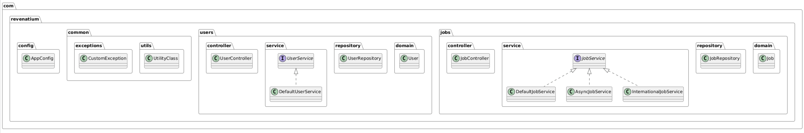
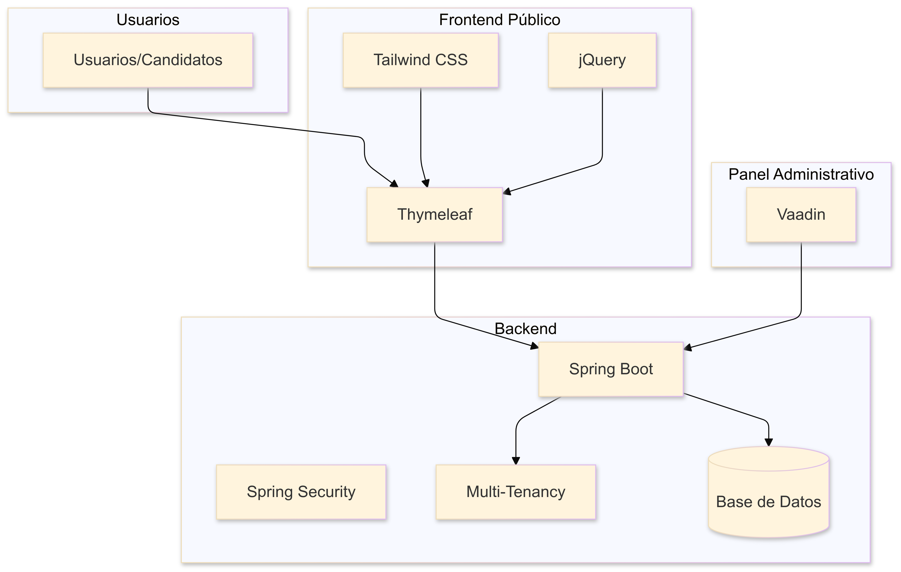
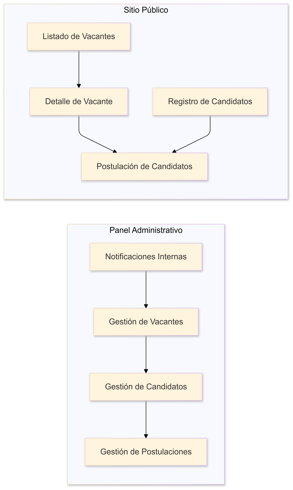
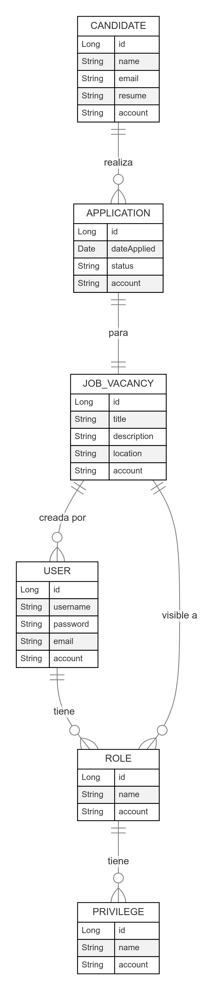
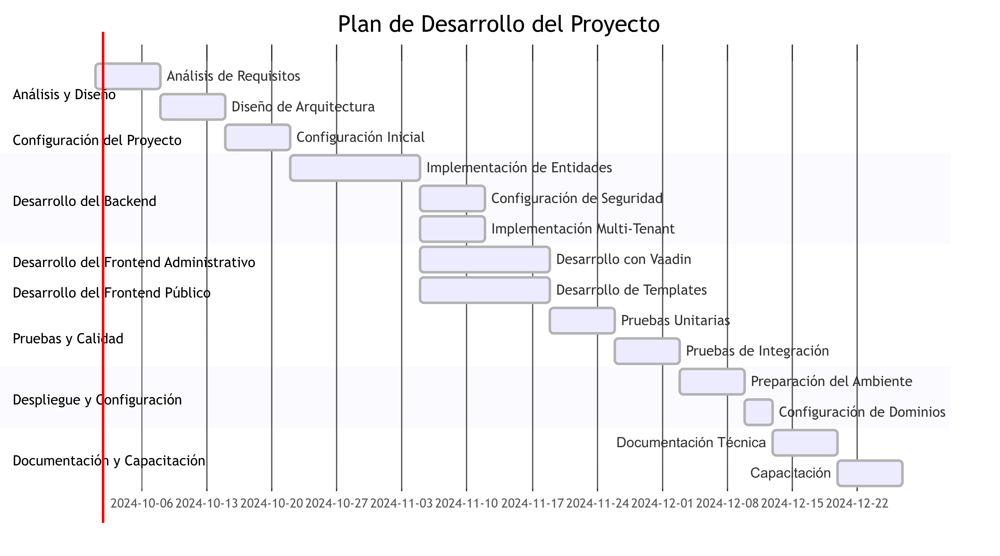

# Requisitos del Producto Mínimo Viable (MVP)

El Producto Mínimo Viable (MVP) es una versión simplificada de un producto que se utiliza para validar la idea y recopilar comentarios de los usuarios. El objetivo es lanzar rápidamente una versión funcional que proporcione valor y permita iterar sobre la base de la retroalimentación recibida.

En este proyecto, el MVP se centrará en la creación de una aplicación API REST que permita a los usuarios registrarse y postularse a ofertas de trabajo. A continuación, se detallan los requisitos mínimos que se deben cumplir para considerar el MVP como completado:

- **Centralización**: Unificar la gestión de vacantes y postulaciones en un solo sistema.
- **Personalización**: Ofrecer experiencias personalizadas para cada cliente (tenant) basadas en su dominio o subdominio.
- **Eficiencia Operativa**: Simplificar el mantenimiento y reducir la complejidad al migrar de múltiples instancias a una arquitectura multi-tenant.
- **Escalabilidad**: Sentar las bases para futuras mejoras y funcionalidades adicionales.

## Funcionalidades Esenciales

### 1. Autenticación y Autorización de Usuarios

- **Inicio de Sesión Seguro**:
  - Implementar autenticación mediante Spring Security.
  - Soportar roles y privilegios (administrador, reclutador, etc.).
- **Gestión de Usuarios**:
  - Crear, editar y eliminar usuarios del sistema.
  - Asignar roles y permisos específicos.
- **Recuperación de Contraseña**:
  - Funcionalidad para restablecer contraseñas olvidadas mediante correo electrónico.

### 2. Infraestructura Multi-Tenant

- **Detección de Tenant**:
  - Identificar el tenant basado en el dominio o subdominio de la solicitud.
- **Aislamiento de Datos**:
  - Todas las entidades deben incluir el campo `account` para discriminar los datos por tenant.
  - Asegurar que los usuarios solo puedan acceder a los datos correspondientes a su tenant.
- **Configuraciones Personalizadas**:
  - Cargar configuraciones específicas (logos, colores, estilos) para cada tenant.

### 3. Panel Administrativo con Vaadin

- **Gestión de Vacantes**:
  - Crear, editar, publicar y archivar vacantes.
  - Definir detalles de la vacante (título, descripción, requisitos, ubicación, salario).
- **Gestión de Candidatos**:
  - Visualizar lista de candidatos que han aplicado.
  - Acceder al perfil y CV de cada candidato.
- **Gestión de Postulaciones**:
  - Filtrar y buscar postulaciones por vacante, fecha, estado.
  - Actualizar el estado de las postulaciones (en revisión, entrevistado, contratado, rechazado).
- **Notificaciones Internas**:
  - Alertas al administrador o reclutador sobre nuevas postulaciones.

### 4. Sitio Público con Thymeleaf

- **Listado de Vacantes**:
  - Mostrar todas las vacantes disponibles para el tenant actual.
  - Permitir filtrar vacantes por categoría, ubicación o palabras clave.
- **Detalle de Vacante**:
  - Mostrar información detallada de la vacante seleccionada.
- **Registro y Postulación de Candidatos**:
  - Formulario de registro de candidatos con validación de datos.
  - Permitir a los candidatos adjuntar su CV y otros documentos.
  - Confirmación de postulación exitosa.
- **Diseño Responsivo y Personalizado**:
  - Interfaz adaptada a dispositivos móviles y de escritorio.
  - Aplicar branding específico del cliente (logos, colores).

### 5. Diseño Responsivo y Branding

- **Tailwind CSS**:
  - Utilizar Tailwind CSS para facilitar el diseño responsivo.
- **Personalización por Tenant**:
  - Cargar estilos y recursos (imágenes, fuentes) específicos para cada tenant.

### 6. Seguridad y Cumplimiento

- **Protección de Datos**:
  - Cumplir con normativas de protección de datos personales.
- **Validación y Sanitización de Entradas**:
  - Prevenir inyecciones SQL y XSS.
- **Certificados SSL**:
  - Asegurar que todas las comunicaciones sean a través de HTTPS.

## Funcionalidades Adicionales (Deseables pero no esenciales)

### 1. Notificaciones por Correo Electrónico

- **Confirmación de Postulación**:
  - Enviar correo al candidato confirmando su postulación.
- **Actualizaciones de Estado**:
  - Notificar al candidato sobre cambios en el estado de su postulación.

### 2. Búsqueda y Filtrado Avanzado

- **En el Sitio Público**:
  - Mejorar las opciones de búsqueda y filtrado de vacantes.
- **En el Panel Administrativo**:
  - Facilitar la gestión mediante filtros avanzados y búsqueda.

### 3. Soporte Multilingüe

- **Internacionalización (i18n)**:
  - Soportar múltiples idiomas en el sitio público y el panel administrativo.
- **Selección de Idioma**:
  - Permitir a los usuarios seleccionar su idioma preferido.

## Requisitos Técnicos

### Backend

- **Spring Boot**:
  - Versión actualizada para asegurar compatibilidad y soporte.
- **Spring Security**:
  - Configuración para autenticación y autorización multi-tenant.
- **Base de Datos**:
  - Utilizar una base de datos relacional (ej. PostgreSQL, MySQL).
  - Implementar repositorios JPA con filtrado por `account`.

### Frontend Administrativo

- **Vaadin**:
  - Versiones LTS para estabilidad.
  - Diseñar una interfaz intuitiva y fácil de usar.

### Frontend Público

- **Thymeleaf**:
  - Utilizar Thymeleaf Layout Dialect para layouts dinámicos.
- **Tailwind CSS**:
  - Configuración personalizada para cada tenant.
- **jQuery**:
  - Para interacciones y validaciones en el frontend.

## Consideraciones de Desarrollo

### Gestión de Proyectos

- **Metodología Kanban**:
  - Utilizar tableros para visualizar y gestionar el flujo de trabajo.
- **Estimación de Tareas**:
  - Aplicar PERT para estimaciones más precisas.
- **Priorización**:
  - Emplear la matriz de Eisenhower y el método MoSCoW.
- **Asignación de Recursos**:
  - Dos programadores, distribuyendo tareas según especialización.

### Calidad y Pruebas

- **Pruebas Unitarias**:
  - Cobertura mínima del 70% en backend y frontend.
- **Pruebas de Integración**:
  - Verificar la interacción entre componentes.
- **Revisión de Código**:
  - Implementar prácticas de code review entre los desarrolladores.

### Despliegue y Hosting

- **Ambiente de Desarrollo**:
  - Configuración local para pruebas y desarrollo.
- **Ambiente de Producción**:
  - Despliegue en servidores seguros y escalables.
- **Gestión de Dominios**:
  - Configurar los dominios y subdominios para cada tenant.
- **Certificados SSL**:
  - Implementar certificados para cada dominio/subdominio.

## Cronograma y Entregables

### Fases del Proyecto

1. **Análisis y Diseño**:
   - Definición de requisitos detallados.
   - Diseño de arquitectura y base de datos.
2. **Configuración del Proyecto**:
   - Configuración inicial de Spring Boot, Vaadin y Thymeleaf.
   - Implementación de multi-tenancy básica.
3. **Desarrollo del Backend**:
   - Implementación de entidades, repositorios y servicios.
   - Configuración de Spring Security.
4. **Desarrollo del Frontend Administrativo**:
   - Creación de vistas y componentes con Vaadin.
   - Integración con el backend.
5. **Desarrollo del Frontend Público**:
   - Diseño de templates con Thymeleaf.
   - Implementación de estilos con Tailwind CSS.
   - Funcionalidad con jQuery.
6. **Pruebas y Calidad**:
   - Ejecución de pruebas unitarias y de integración.
   - Corrección de bugs y mejoras.
7. **Despliegue y Configuración**:
   - Preparación del ambiente de producción.
   - Configuración de dominios y certificados.
8. **Documentación y Capacitación**:
   - Documentación técnica y manuales de usuario.
   - Capacitación al equipo de soporte y a los clientes.

### Entregables

- **Código Fuente**:
  - Repositorio en GitHub con el código actualizado.
- **Documentación Técnica**:
  - Diagramas de arquitectura, modelo de datos y manuales de instalación.
- **Manual de Usuario**:
  - Guías para administradores y usuarios finales.
- **Ambiente de Producción**:
  - Sistema desplegado y accesible en los dominios correspondientes.

## Criterios de Aceptación

- **Funcionalidad Completa**:
  - Todas las funcionalidades esenciales deben estar implementadas y operativas.
- **Calidad del Software**:
  - El sistema debe ser estable, seguro y eficiente.
- **Satisfacción del Cliente**:
  - El sistema debe cumplir con las expectativas y necesidades de los clientes (tenants).
- **Documentación Completa**:
  - La documentación debe ser clara y detallada, facilitando el mantenimiento y futuras expansiones.

## Riesgos y Mitigación

- **Riesgo**: Retrasos en el desarrollo por dificultades técnicas.
  - **Mitigación**: Planificación realista y seguimiento continuo del progreso.
- **Riesgo**: Problemas de seguridad en la implementación multi-tenant.
  - **Mitigación**: Revisiones de seguridad y pruebas exhaustivas.
- **Riesgo**: Incompatibilidades entre tecnologías.
  - **Mitigación**: Pruebas de integración tempranas y elección de versiones compatibles.

---

**Nota**:

El desarrollo del MVP es un paso crucial para establecer una base sólida del sistema multi-tenant de gestión de vacantes y registro de candidatos. Al enfocarnos en las funcionalidades esenciales y garantizar una alta calidad en el software, sentamos las bases para futuras mejoras y funcionalidades adicionales que incrementarán el valor para los clientes y usuarios finales.

Este documento es una guía para el equipo de desarrollo y partes interesadas, y está sujeto a cambios según las necesidades y circunstancias que puedan surgir durante el proyecto.

---

## Anexos

### Anexo A: Diagrama de Arquitectura (Esquemático)

### Anexo B: Estructura del proyecto y tecnologías

### Anexo C: Funcionalidades básicas

### Anexo D: Modelo de Datos (Esquemático)

### Anexo E: Diagrama de Gantt

